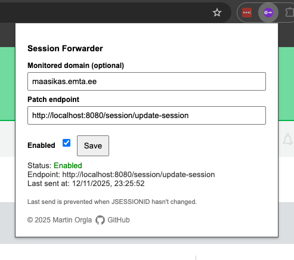

# JSession Forwarder

## Description  
JSession Forwarder is a Chrome extension that reads the `JSESSIONID` and `XSRF-TOKEN` cookies from the current site and sends their values to a specified endpoint via a `PATCH` request.


## Features

- Automatically detects `JSESSIONID` and `XSRF-TOKEN` cookies on the active page.
- Sends the session data to your configured endpoint.
- Stores the timestamp of the last successful session forwarding.
- Simple and lightweight Chrome extension with a popup for configuration.

## Screenshot



## Installation

1. Clone or download the repository.
2. Open Chrome and navigate to `chrome://extensions/`.
3. Enable **Developer mode** in the top-right corner.
4. Click **Load unpacked** and select the folder containing the extension files.

> Note: Once installed, the extension icon will appear in the toolbar.

## Usage

1. Navigate to the website where you are logged in.
2. Click the **JSession Forwarder** icon in the Chrome toolbar.
3. The extension will automatically detect the cookies and send them to your endpoint.
4. The last sent time is stored in Chrome's local storage alongside with the configured endpoint.

## Storage

- `sentResTime` in Chrome's `localStorage` keeps track of the timestamp when the last session was successfully sent.
- Example of reading it:

```javascript
chrome.storage.local.get('sentResTime', (data) => {
  if (data.sentResTime) {
    const lastSent = new Date(data.sentResTime);
    console.log('Last session forwarded at:', lastSent.toLocaleString());
  }
});
```

## Permissions

The extension requires the following permissions:

- `cookies` – to read `JSESSIONID` and `XSRF-TOKEN`.
- `storage` – to store the last sent timestamp.
- `activeTab` – to access cookies for the current tab.
- `webRequest` / `webRequestBlocking` (optional) – if you extend it to listen for AJAX requests.

## Icon

- The extension comes with a toolbar icon representing a cookie and a forwarding arrow.
- 32x32 PNG is used for all required sizes (16×16, 32×32).
- Scalable icon file `icon.svg` is also included.

## Contributing

Contributions are welcome. Feel free to submit issues or pull requests for improvements.

## License

This project is licensed under the MIT License.